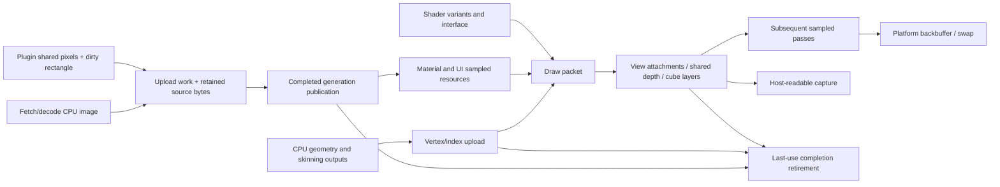

# Resource, state, platform and delivery contracts

Current mandate: the selected DiligentCore GHI must provide native Vulkan UI and
connected chat as a peer backend, with no world rendering and no achievable
OpenGL fallback. See the
[first-deliverable scope](qualification-roadmap.md#first-deliverable-for-vkstorm-vulkan).
Historical startup/restart/staging proposals for GL fallback below are
superseded. Failures must report their cause and stop the Vulkan session; the
minimal UI/chat execution path must not require GL resources or contexts.

Audit baseline: `1a490c3cb7ed60124169bf4bf6ad61a6ae1eeec5`, feature branch `codex/vulkan-pipeline-audit-design`, 3 October 2026. Implementation targets are Windows and Linux; macOS/SDL 1/headless code is reference/conditional inventory, not a promised new target. This is source analysis and proposed design, not an implemented or benchmarked Vulkan backend. Source links below pin this revision. Runtime execution, GPU traces and cross-platform builds were not performed for this document.

The scope contains **13 component records: R01–R09, P01–P03 and B01**. All have source-backed principal contracts and proposed interfaces. Conditional code is classified separately inside each record. The implementation gaps listed below are unresolved evidence, not silently assumed behavior. Draw-pass and scene semantics belong to the connected pipeline/scene reports; these resource records do not independently claim whole-viewer behavioral coverage.

## Connected resource path

## GL state and ownership ledger

| ID / classification | Actual contract and hidden state | Ownership, gates and failure behavior | Proposed Vulkan/GHI contract |
|---|---|---|---|
| R01, active: drawing/state facade | [LLRender::refreshState](https://github.com/anne-skydancer/vulkanstorm/blob/1a490c3cb7ed60124169bf4bf6ad61a6ae1eeec5/indra/llrender/llrender.cpp#L932), `setSceneBlendType` L 1406, `flush`/immediate emission L 1591–1787. Texture-unit cache and matrix stacks are ambient state; state changes can flush buffered primitives. LLGLState/LLGLDepthTest guards in `llgl.cpp` track/restores cached enables/depth. Raw GL calls outside the facade can invalidate assumptions. | `gGL` and shader/vertex global bound-state caches coordinate render calls. Immediate data become VBO draws; this is not legacy-driver immediate mode. Wrapper calls alone do not describe complete draw state: viewport, scissor, framebuffer and pixel-store also exist elsewhere. | Immutable `DrawPacket` captures resource generations, transforms, shader variant, topology, blend/depth/raster and view. Pass encoder owns viewport/scissor/attachments. Keep CPU matrix math, but translate conventions at the view ABI. Dynamic state is explicit and cannot leak between packets. Native implementation or GHI must consume the same packet contract, not GL callbacks. |
| R02, active: vertex/index resource pools | [LLVertexBuffer::allocateBuffer](https://github.com/anne-skydancer/vulkanstorm/blob/1a490c3cb7ed60124169bf4bf6ad61a6ae1eeec5/indra/llrender/llvertexbuffer.cpp#L1256), mapping L 1292, flush L 1372, drawing L 942, setBuffer L 1660 onward. Default pool allocates `GL_DYNAMIC_DRAW` buffers plus aligned CPU shadow bytes; size bins cache freed names/CPU storage. Updates use `glBufferSubData` chunks. Apple has a separate CPU-to-GPU path. Attribute masks/offsets and U16/U32 index paths are part of the ABI. | `sGLRenderBuffer`/`sGLRenderIndices` cache bindings. `ENABLE_GL_WORK_QUEUE` is **0** at L 74: worker definitions and thread creation are dormant, not evidence of parallel VBO rendering. Buffer pool assumes GL driver lifetime semantics. | Static geometry uses device-local suballocations; dynamic geometry uses per-flight upload ranges with explicit size/stride/index type. A generation plus last-use token prevents CPU overwrite and pool reuse while GPU readers exist. Start with graphics-queue copy; a transfer queue is a measured option, not automatic. Keep CPU production and dirty-range tracking independent of backend objects. |
| R03, active: image allocation/mips/formats/retirement | [LLImageGL::setImage](https://github.com/anne-skydancer/vulkanstorm/blob/1a490c3cb7ed60124169bf4bf6ad61a6ae1eeec5/indra/llrender/llimagegl.cpp#L748), create L 1631, manual format conversion L 1324, alpha analysis L 2200 onward. Inputs include raw/compressed bytes, mip presence/discard level, primary/internal/type format, address/filter policy. Core-profile alpha/luminance handling uses conversion/swizzle. Alpha masks and picking masks are CPU analyses, not GPU effects. | LLImageGL owns texture name, byte accounting, discard level and CPU pick mask. [deleteTextures/updateClass](https://github.com/anne-skydancer/vulkanstorm/blob/1a490c3cb7ed60124169bf4bf6ad61a6ae1eeec5/indra/llrender/llimagegl.cpp#L1284) queue deletion in a frame-indexed ring with `DELETE_DELAY=3`. The code increments frame count and frees `(frame+3)%4`, while enqueue uses `frame%4`; an item can therefore reach the freed bucket on the next update, despite the three-frame comment. No runtime deletion timing was measured. **A frame-count delay is not a native GPU completion proof.** Default texture fallback in LLTexUnit::bind remains required when image unavailable. | `ImageDescription` records dimensions, subresources, color/alpha interpretation, compression and sampler independently; `ImageGeneration` is immutable while referenced by a submitted frame. Query sampled/filter/transfer/blit/storage support per chosen format. Preserve BC/sRGB distinctions, mip/discard policy and CPU alpha/pick masks. Last-use completion retires allocation, view and descriptor together. Allocation/upload failure retains old valid generation or fallback. |
| R04, conditional: worker upload and publication | [LLImageGLThread](https://github.com/anne-skydancer/vulkanstorm/blob/1a490c3cb7ed60124169bf4bf6ad61a6ae1eeec5/indra/llrender/llimagegl.cpp#L2629) runs exactly one worker and shared GL context; run makes it current and initializes its GL facade. [syncToMainThread](https://github.com/anne-skydancer/vulkanstorm/blob/1a490c3cb7ed60124169bf4bf6ad61a6ae1eeec5/indra/llrender/llimagegl.cpp#L1745) fences uploaded texture: NVIDIA client-waits on worker; other vendors enqueue main-context `glWaitSync` before texture-name swap. CPU callback completion and GPU upload completion are distinct. | `initClass` L 249 gates textures/media on configured flags and GL >3.95. [scheduleCreateTexture](https://github.com/anne-skydancer/vulkanstorm/blob/1a490c3cb7ed60124169bf4bf6ad61a6ae1eeec5/indra/newview/llviewertexture.cpp#L1688) refs owner during worker, retains raw bytes and finalizes main-side. Without queue, main create list is fallback. Context destruction is on worker. Constructor failure/SDL 1 interaction remains an explicit edge-case gap below. | `UploadRequest` owns bytes until copy submission no longer needs them; it produces `{resource generation, completion value, final layout, queue family}`. Main snapshot publishes a generation only with a wait/dependency consumable by draw submission; callbacks do not authorize reuse. One serialized queue submit owner initially; worker pools prepare/record batches with per-worker pools. Use API completion instead of vendor-name synchronization branches. |
| R05, active/conditional: shader wrapper, variants and cached ABI | [LLGLSLShader::createShader](https://github.com/anne-skydancer/vulkanstorm/blob/1a490c3cb7ed60124169bf4bf6ad61a6ae1eeec5/indra/llrender/llglslshader.cpp#L407) unloads old program, hashes defines/features, tries binary cache, compiles files/feature attachments, maps attributes/uniforms, falls back to lower shader level. [LLShaderMgr::loadShaderFile](https://github.com/anne-skydancer/vulkanstorm/blob/1a490c3cb7ed60124169bf4bf6ad61a6ae1eeec5/indra/llrender/llshadermgr.cpp#L462) searches shader classes and injects defines/indexed-texture-channel configuration. L 1049 bind changes global program, resets vertex binding; uniform cache uses value/matrix/light hashes. Rigged and GLTF variants exist. | Shader manager owns source/cache and reserved interface names; shader instances own programs/variants. Linking/compile failure can reduce shader level; an `#if 0` error-shader path is dormant. Raw GLSL source count is not linked-program variant count. Actual pass routes are in pipeline report. | Build Vulkan-compatible SPIR-V with explicit reflected vertex attributes, uniform/storage blocks and descriptor bindings. Proposed sets: view/frame, material textures/constants, object/skin; choose stable layouts before variant expansion. Pipeline key includes rendering formats/sample count plus vertex ABI and fixed state. Validate reflection at build/load; cache SPIR-V separately from device-specific pipeline cache; reject mismatched ABI rather than quietly reducing shader class. Retain old complete pipeline generation on hot-reload failure. |
| R06, active: render targets, external attachments, shared depth and nested views | [LLRenderTarget::allocate](https://github.com/anne-skydancer/vulkanstorm/blob/1a490c3cb7ed60124169bf4bf6ad61a6ae1eeec5/indra/llrender/llrendertarget.cpp#L105), add attachment L205, share depth L321, bind L420, flush L503. Allocation clamps extent; FBO completeness checked. Binding writes draw/read buffers and viewport, links previous target; flush emits gGL work, optionally generates mips, restores previous FBO or default backbuffer viewport. External image attachments have different ownership from internal ones. | Target owns color textures/FBO and owned depth; borrowing depth does not transfer ownership. `sBoundTarget`, `sCurFBO`, `sCurResX/Y`, `mPreviousRT` are an implicit stack. Resize/release disallows bound target. Allocation shortcut checks extent/usage/depth/mip policy, not all imaginable formats: graph must use explicit descriptions rather than reproduce this cache key. | `ViewGraph` declares each attachment/subresource, extent, format, load/store policy and borrowed depth alias. Native allocator owns images; pass only borrows handles. Replace target stack with explicit nested/auxiliary graph nodes; dynamic rendering is a baseline candidate, not an implicit synchronization solution. Track attachment→sampled/transfer layout per mip/layer. Resize creates a new graph/resource generation and retires old completion-safe. |
| R07, conditional: cube/cube-array resources | [LLCubeMapArray::allocate](https://github.com/anne-skydancer/vulkanstorm/blob/1a490c3cb7ed60124169bf4bf6ad61a6ae1eeec5/indra/llrender/llcubemaparray.cpp#L142), copying/resizing L114–133; [LLCubeMap::generateMipMaps](https://github.com/anne-skydancer/vulkanstorm/blob/1a490c3cb7ed60124169bf4bf6ad61a6ae1eeec5/indra/llrender/llcubemap.cpp#L229). Array layers are six faces per probe, optional HDR and explicit mip allocation. Copy/resize helper performs GPU readback then CPU scaling/upload; cube-map-array allocation avoids an AMD-sensitive auto-mipmap allocation path. | Cube wrapper image refs and texture units own/bind storage. Face ordering differs between legacy cube helper's target list and array target list: preserve semantic face orientation, not enum ordering assumptions. Probe update schedules and convolution belong to pass report. | Cube-compatible 2D images, six-layer groups and cube-array views. Layer/mip graph tracks capture→convolution→sampling; publication tracks valid face/mip generations and preserves source partial-update visibility; complete-cube atomic publication is a separate behavioral change requiring qualification (F06). Keep explicit HDR/color encodings. GPU blit/compute copy/resize is an optional replacement after format-filter/orientation/parity checks; preserve CPU fallback when unsupported. |
| R08, conditional: texture readback | [LLImageGL::readBackRaw](https://github.com/anne-skydancer/vulkanstorm/blob/1a490c3cb7ed60124169bf4bf6ad61a6ae1eeec5/indra/llrender/llimagegl.cpp#L1812) validates discard and allocates LLImageRaw, handling compressed/uncompressed transfer. Cube resize above is another readback consumer. Framebuffer snapshot/picking routes are separate report entries. | Raw-image CPU ownership is separate from texture; compressed bytes versus decoded pixels and pack alignment matter. These functions can synchronize CPU with GL implicitly; timing is unmeasured. | `ReadbackRequest` identifies subresource/region/output encoding, destination host buffer and completion. Transition actual prior image layout to transfer source, copy, synchronize transfer-write→host-read and invalidate noncoherent memory after completion. Restore future layout through graph use. Preserve synchronous public behavior where caller requires it; asynchronous API needs caller changes and explicit latency budget. |
| R09, conditional: media pixels and dynamic texture publication | [LLViewerMediaImpl::update](https://github.com/anne-skydancer/vulkanstorm/blob/1a490c3cb7ed60124169bf4bf6ad61a6ae1eeec5/indra/newview/llviewermedia.cpp#L3030), preMediaTexUpdate L 3086, doMediaTexUpdate L 3136. Visibility/suspend/plugin exit gates; dirty rect clamped, plugin pointer not copied into LLImageRaw. mTextureUpdatePending prevents overlapping update; refs pin owner/texture; worker uses lock against teardown. Each update creates a fresh texture then uploads dirty rect, with explicit NVIDIA stall workaround rationale in source. | Main and worker callbacks publish texture names and clear pending flag. Plugin shared-memory mutation/publication protocol is not fully verified here: lock protects teardown, not by itself every plugin writer. The handling of non-dirty content in a newly allocated image needs runtime/caller contract validation before changing strategy. | Snapshot/retain plugin bytes with documented producer fence or CPU copy before queueing; update ring of persistent media image generations. Preserve unchanged areas by copy-forward or maintain complete CPU image; do not assume untouched pixels in new storage valid. Dirty-rect copy and pitch are explicit. Graphics-queue dependency and generation retirement protect sampling. Measured upload bandwidth/latency decides persistent image versus ring. |
| P01, active/conditional: startup, backend selection, capabilities | [LLAppViewer::initWindow](https://github.com/anne-skydancer/vulkanstorm/blob/1a490c3cb7ed60124169bf4bf6ad61a6ae1eeec5/indra/newview/llappviewer.cpp#L3734) warns that Vulkan pipeline is unavailable and falls back to GL. Win [selectGLBackend](https://github.com/anne-skydancer/vulkanstorm/blob/1a490c3cb7ed60124169bf4bf6ad61a6ae1eeec5/indra/newview/llappviewerwin32.cpp#L1098) preloads Mesa/native GL; Linux equivalent L 104 activates private GLVND provider. [LLGLManager::initGL](https://github.com/anne-skydancer/vulkanstorm/blob/1a490c3cb7ed60124169bf4bf6ad61a6ae1eeec5/indra/llrender/llgl.cpp#L1075) detects vendor/version/memory/extensions, limits and flags. Shared contexts use WGL/CGL/SDL 2; SDL 1 explicitly unavailable. | Core profile uses saved settings at app init L 622. Settings and feature tables affect threading, anisotropy and format paths. API-loader choice precedes first GL import. There is no native Vulkan device or queue created by this selection. | Separate instance/device/surface creation from GL initialization. Query feature/property/format/queue matrix, enable only actual requirements; create a complete native backend or report the startup failure and stop the Vulkan session. Vulkan 1.3 + dynamic rendering/synchronization 2 and Vulkan 1.2 timeline support are proposed starting capability tier, subject to hardware inventory; portability tier can use extension equivalents or render passes. Do not claim macOS parity before portability qualification. |
| P02, active/conditional: present, swap interval, resize | [Win swapBuffers](https://github.com/anne-skydancer/vulkanstorm/blob/1a490c3cb7ed60124169bf4bf6ad61a6ae1eeec5/indra/llwindow/llwindowwin32.cpp#L3870) calls OS SwapBuffers then profiler collect; swap interval L 1980 has unavailable-extension fallback. SDL 2 L 1160 and macOS L 1102 use platform GL present. | Window/context lifetime owns backbuffer; renderer assumes default framebuffer exists. Window resize and pipeline attachment resize must stay coupled. Actual pacing under drivers, Zink, minimized windows and display transitions is unmeasured. | Platform surface + acquire/submit/present state machine; query formats/color spaces/present modes and graphics/present family support. Semaphore for render-finished is per swapchain image; acquire semaphore and command/descriptor pools are per reusable flight slot. Resize/out-of-date waits only required old-generation work; zero extent suspends rendering. Avoid conflating submitted graphics completion with presentation completion. |
| P03, active/deprecated: shutdown and context recovery | [shutdownGL](https://github.com/anne-skydancer/vulkanstorm/blob/1a490c3cb7ed60124169bf4bf6ad61a6ae1eeec5/indra/newview/llviewerwindow.cpp#L2644) orders font/sky/pipeline/wearables/textures/bump/maps/imageGL/select/GL/VBO cleanup. [stopGL](https://github.com/anne-skydancer/vulkanstorm/blob/1a490c3cb7ed60124169bf4bf6ad61a6ae1eeec5/indra/newview/llviewerwindow.cpp#L7019) pauses fetch/cache, destroys subsystem resources, marks disabled and unloads shader instances. restoreGL L 7080 asserts and explicitly says deprecated/unreliable; no proven recovery capability. | Background work and queued refs interact with teardown. GL implicit object lifetime and existing ordered callbacks cannot be used as Vulkan destruction guarantees. | Stop producers; drain/cancel CPU upload jobs with retained byte owners; complete submitted work; retire pipelines/descriptors/views/images/buffers then surface/device. Device loss requires stop + explicit restart/failure policy; do not promise automatic reconstruction from deprecated restoreGL. |
| B01, conditional: dependencies and staging | [MesaZink.cmake](https://github.com/anne-skydancer/vulkanstorm/blob/1a490c3cb7ed60124169bf4bf6ad61a6ae1eeec5/indra/cmake/MesaZink.cmake#L9) gates 64-bit Windows/Linux, defaults off outside CI. Requires DLLs on Win, private GLX/Gallium on Linux. [newview CMake](https://github.com/anne-skydancer/vulkanstorm/blob/1a490c3cb7ed60124169bf4bf6ad61a6ae1eeec5/indra/newview/CMakeLists.txt#L2284) delay-loads GL DLL and later stages Mesa; Copy 3 rdPartyLibs L 100 and viewer_manifest L 736/L 2324 package selected runtime. Autobuild mesazink installable supplies these libraries. | Mesa installable is GL-over-Vulkan, not native viewer code. Missing staged runtime fails configure. Fully staged development directory includes plugins/assets, not executable alone. Native renderer dependencies are not defined here. | GL/Zink remains a separate GL backend for AMD GPUs affected by rendering regressions caused by bugs in the AMD OpenGL ICD; it is not a Vulkan fallback. Add versioned Vulkan loader/headers, shader compiler, SPIR-V tools and selected allocator/GHI packages through Autobuild; stage shaders/pipeline manifest and any runtime DLLs with normal viewer assets. Platform CI must test clean staged execution, shader/reflection version mismatch, loader absence and packaging. No current files changed by this proposal. |

## Decision-linked Khronos guidance

Accessed **2026-10-03**. Documentation is Khronos `latest`, whose stable numeric spec revision is not surfaced by these chapter responses; pin a Vulkan-Headers/spec release before implementation. The portability-subset reference explicitly reports revision 1. Recommendations below are proposed viewer engineering choices unless identified as normative.

- **R02/R03 allocation:** use the qualified library allocator or an eligible supporting utility such as AMD VMA; policy does not require a handcrafted viewer allocator. Qualify exact license/build, capabilities, lifetime, pressure, fragmentation and residency against eligible common-library alternatives. Vendor origin is not an exclusion or AMD-only selector. [Khronos memory guidance](https://docs.vulkan.org/guide/latest/memory_allocation.html) supports suballocation; no allocator is selected or benchmarked here.
- **R02/R04 uploads:** host writes complete before submission; noncoherent mapped ranges flushed with required alignment, upload range retained until completion. [vkFlushMappedMemoryRanges](https://docs.vulkan.org/refpages/latest/refpages/source/vkFlushMappedMemoryRanges.html) specifies host-write availability; flush does not prove GPU completion. Copy→vertex/index dependencies use transfer-write→vertex-attribute/index-read; copy→sampled-image uses transfer-write→actual consuming shader sampled-read and layout transition. Khronos [Synchronization Examples, Transfer Dependencies](https://docs.vulkan.org/guide/latest/synchronization_examples.html) is the explanatory template; scopes derive from actual consumer, including vertex sampling where used.
- **R03/R04/R06/R08 lifetime/layout:** maintain subresource layout/access and queue owner plus last-use completion token. [Synchronization and Cache Control, Execution and Memory Dependencies / Image Layout Transitions](https://docs.vulkan.org/spec/latest/chapters/synchronization.html) is normative: explicit dependencies must resolve hazards; transitions preserve contents only with matching prior layout, and `UNDEFINED` can discard. Queue-family changes require correct release/acquire plus semaphore dependency. GL's frame-indexed texture deletion cannot be transplanted. [vkDestroyBuffer valid usage](https://docs.vulkan.org/refpages/latest/refpages/source/vkDestroyBuffer.html) requires submitted commands referring to the buffer completed before destruction; apply equivalent per-object rules to images/views/pipelines.
- **R04 recording:** batch upload/draw recording with a command pool per worker per flight slot, serialize shared queue submissions, reset only after completion. [Command buffer usage and multi-threaded recording](https://docs.vulkan.org/samples/latest/samples/performance/command_buffer_usage/README.html) discusses recording/pool ownership and avoiding tiny command buffers. Its workload results do not predict viewer speedup. Begin single queue and measure before asynchronous transfer complexity.
- **R05 shader ABI:** specify blocks, descriptors, array indexing and offsets explicitly, verify reflection; [Mapping Data to Shaders](https://docs.vulkan.org/guide/latest/mapping_data_to_shaders.html) explains interfaces and descriptor binding. Bindless descriptors are optional and require the exact indexing features/limits used; the presence of an extension alone is insufficient.
- **R06 attachment strategy:** dynamic rendering is suitable for variable-sized auxiliary/probe views and avoids large render-pass combinations; it does not establish automatic graph dependencies. Query/enable [VkPhysicalDeviceDynamicRenderingFeatures](https://docs.vulkan.org/refpages/latest/refpages/source/VkPhysicalDeviceDynamicRenderingFeatures.html), core 1.3 or `VK_KHR_dynamic_rendering`. A traditional render-pass/subpass implementation remains a portability/bandwidth candidate if actual device/workload measurements favor it.
- **P01 capabilities:** enumerate/query then enable extensions **and feature bits** as [Enabling Extensions](https://docs.vulkan.org/guide/latest/enabling_extensions.html) describes. For a macOS portability implementation, advertised [VK_KHR_portability_subset](https://docs.vulkan.org/refpages/latest/refpages/source/VK_KHR_portability_subset.html) must be enabled and queried limitations honored; do not infer full Vulkan support from a loader.
- **P02 WSI:** per-image render-finished semaphores and separate flight-slot fences follow [Swapchain Semaphore Reuse](https://docs.vulkan.org/guide/latest/swapchain_semaphore_reuse.html). Present resource retirement requires its own supported completion strategy; a graphics-submit fence alone does not prove present is finished.

## Native versus GHI decision gates

[framework-comparison.md](framework-comparison.md) maps these resource/platform contracts to pinned DiligentCore and bgfx APIs, including the key difference between explicit Diligent fence/staging visibility and bgfx frame-return readback/command scheduling. The paired matrix retains all existing IDs.

The Vulkan/GHI responsibility columns above specify required contracts, not instructions to handcraft backend services. Library allocation, resource tracking, transition, submission and retirement APIs should fulfill them. Viewer-owned publication and consumer generations remain semantic integration; extensive replacement infrastructure is a feasibility failure.

The recommendation is to qualify DiligentCore as the leading mature common GHI, with bgfx comparator. Delegate device/allocation/descriptor/PSO/command/barrier/lifetime infrastructure; viewer owns semantic graph/residency/publication contracts. Bespoke infrastructure is infeasible under current capacity. Native escapes must be bounded exceptions; if no library qualifies, retain GL/Zink and report feasibility blockage. Qualified vendor utilities and conditional NVIDIA NVRHI remain eligible as described in [architecture.md](architecture.md).

A GHI can own resource allocation, submission/retirement, descriptor and platform abstractions while a viewer-specific graph owns semantic passes. It is acceptable only if it exposes precise mip/layer barriers, graphics/compute/storage atomics, custom SPIR-V shaders and attachment formats, readback completion and presentation lifetime. Test these against the actual PPLL, probes, UI/media and auxiliary view requirements from the other reports. Treat opaque internal synchronization and unsupported per-subresource operations as rejection criteria. A thin viewer-owned GHI over Vulkan remains viable; a mature external implementation must first pass these contract tests.

Bespoke Vulkan provides direct control but requires handcrafted allocator, WSI, state and lifetime machinery: it is excluded as primary or fallback under the current capacity constraint. Mature GHI candidates must supply those services. GL resource classes still cannot serve as the target GHI because their effects include ambient state, shared-context callbacks and texture names. Preserve semantic CPU data and use library-owned low-level resources; GL/Zink remains the source reference.

## Explicit evidence gaps and discriminating qualification

1. **R01/R05 ABI completeness:** principal wrappers traced; every raw-GL mutation and linked shader variation must be reconciled with the master inventory. Reject a candidate graph if it cannot express an actual pass state/interface. No whole-tree state-invalidation correctness proof is claimed.
2. **R04 platform failure:** LLImageGLThread constructor disables textures when shared context fails, while initClass subsequently derives flags from GL version/settings. SDL 1 returns no shared context. Confirm reachable compiled SDL variant and null-context behavior; do not call worker availability guaranteed from settings alone.
3. **R09 media publication:** inspect plugin producer protocol and run repeated resize/seek/plugin-exit/dirty-rectangle tests. Check stable untouched pixels and byte ownership under delayed worker execution. Proposed media ring must disprove stale/undefined regions, not just reduce stalls.
4. **R02/R03 memory pressure:** capture resident/mapped/upload allocations, pool reserve, paging/discard and upload-per-frame histograms. Test 1/2/3 flight slots with deliberate GPU delay; generation reuse must be completion-safe, independent of wall-frame count. Performance estimates remain unmeasured.
5. **R06/R07 formats/views:** enumerate actual attachment configurations through main/shadow/water/probe/map/preview/capture/UI consumers. Check sRGB/linear, depth precision, MSAA, face orientation and mip filtering on Windows/Linux NVIDIA, AMD and Intel target hardware. macOS portability remains outside this target.
6. **P02/P03 WSI/loss:** minimize/restore, DPI/resize/display changes, unsupported present mode, resize while screenshots pending, device loss and shutdown with upload jobs pending. Validation layer absence of errors is necessary but insufficient; match output/capture semantics and detect deadlocks/use-after-free.
7. **B01 platforms:** CMake proves selected source/runtime staging rules, not that all historical window paths are compiled or healthy. Confirm build matrices and runtime loader dependencies with fully staged RelWithDebInfo and Release binaries. No native build, Vulkan benchmark, GPU capture or cross-platform parity was executed by this audit.

Design records map one-to-one to all 13 inventory IDs above; no viewer renderer behavior or dependencies were edited.
