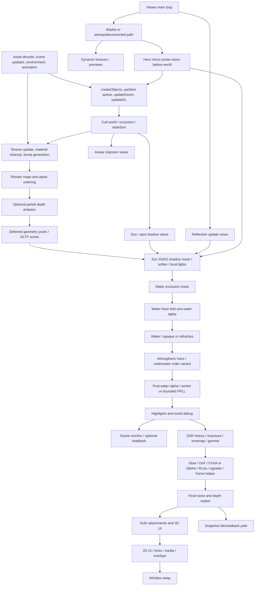
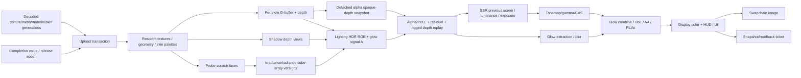

# OpenGL source audit: frame, passes and visual contracts

Baseline: `1a490c3cb7ed60124169bf4bf6ad61a6ae1eeec5`, audited 3 October 2026. Target design: Windows/Linux. Current macOS code is reference inventory only, not a future Metal requirement. This is source reasoning, not a captured GPU trace. Component-level tracing below establishes principal control/data/ownership contracts; it does **not** establish exhaustive branch or compiled shader-permutation coverage. See the explicit gaps below and the accompanying inventories.

## Frame and view graph

[display()][display] is not an isolated renderer. Main-loop reflection updates occur at [LLAppViewer::mainLoop, line 1780][app]; the window/context and shader setup precede it; scene, callbacks and UI can perform GL work outside it. `display()` has startup/progress/disconnected/exiting/snapshot/restore gates before and around ordinary world drawing. It updates dynamic textures **before** resetting the main viewport and depth, so those consumers cannot be discarded during a backend replacement.

This graph is an ordering summary, not a literal claim that every node executes every frame. The insertion rules in [renderGeomPostDeferred()][postgeom] compare **pool enum order**, not a declared pass graph: exclusion starts at WATEREXCLUSION; water haze at ALPHA_PRE_WATER; atmospheric haze at ALPHA_POST_WATER, or before WATER when underwater. HUD skips haze; low-detail cube probes skip haze; opaque-water clipping can skip pre-water alpha. `display_cube_face()` disables main-view occlusion during cull, avoids UI/present/finalize and reuses the deferred scene path. It does not produce an ordinary screen frame.

## Core coverage ledger and GL contracts

Status A: principal active source path traced. C: principal conditional source path traced. D: dormant/empty path demonstrated at this baseline. A/C does not mean every branch is closed. All A/C records have compatible design records in [component-designs.md](component-designs.md).

| ID | Status | Roots and observable contract | Ownership, state, gates and gaps |
|---|---|---|---|
| F01 Frame orchestration | A | [display()][display], `display_update_camera`, main loop; update camera/environment/HUD/geometry/cull/textures/sort, deferred scene, monitor/UI/swap | Main-thread global camera, render-type masks and `sCull` references; `sNoDelete` protects live spatial references until frame end. Snapshot/restore/logout/startup differ. Full exception/early-return state restoration remains a gap. |
| F02 View isolation | C | `display_cube_face` in [display source][display], probe update, shadow/impostor/HUD callers | `gCubeSnapshot`, `sReflectionRender`, `sUnderWaterRender`, camera ID, matrix globals and `mRT` pointer select policy. Nested rendering mutates world state; separate scene/view contracts are essential. Snapshot recursion and previews are detailed in the auxiliary report. |
| F03 Target topology | A | [allocateScreenBufferInternal()][targets], `addDeferredAttachments` at pipeline:381; main/auxiliary/hero RT sets | Diffuse GL_RGBA plus ORM/spec GL_RGBA; normal GL_RGBA 16 when HDR, GL_RGB 10_A 2 otherwise; optional emissive GL_RGB 16 F/GL_RGB. `screen` GL_RGBA 16 F **even when HDR setting off**; screen shares deferred depth. Do not infer all buffers are linear from format. Allocation failure/resolution divisor alters topology. |
| F04 Deferred lighting | A | [renderDeferredLighting()][lighting], `bindDeferredShader` at 9438, `setupSpotLight` at 10332 | G-buffer/depth + shadow/probe/BRDF/light inputs produce screen RGB. Sun/SSAO/shadow light map and blur precede soften; local point/projector additive volumes and fullscreen batches distinguish camera inside/outside. CPU light selection and exact classic/EEP adaptation remain CPU policies. |
| F05 Shadow views | C | [generateSunShadow()][shadows] at 11119; `renderShadow` at 10686, `renderGeomShadow` at 4494 | Four sun depth targets when detail>0; two spot targets when >1 outside cube allocation. Comparison LEQUAL; render uses LESS, polygon offsets/tree settings and optional depth clamp. Per-view cull and rigged/masked/alpha/terrain/tree policies differ. VSM comments/settings are not proof of working VSM (targets here are depth-only). |
| F06 Reflection probes | C | [LLReflectionMapManager::update/doProbeUpdate/updateProbeFace][probes], `LLReflectionMap::update`, main-loop caller | Main/auxiliary RT hot swap; staged six-face direct-light capture then irradiance, six-face radiance capture and convolution; cube-array layer+mip copy; scratch slots and neighbor/probe uniforms persist. Default probe restricts sky/water/cloud/terrain. Probe scheduler, completion and partial-face generation must remain visible contracts. |
| F07 Hero mirrors | C | [LLHeroProbeManager::renderProbes/updateProbeFace/generateRadiance][hero], `display` hero update | Requires mirrors+probes+started, not teleport; 6/rate faces per frame (rate normalized to 1/2/3/6). Temporarily sets radiance mode, mirror flag and hero RT; blur/downsample/cube-array layers then radiance. Mirrored clip and scene exclusions are conditional; no universal reflection recursion. |
| F08 Post chain | A | [renderFinalize()][finalize] and functions 8252–9190 | HDR-gated SSR copy/luminance/exposure/tonemap/CAS versus gamma-only; glow extraction/blur/combine; edit-dependent DoF; FXAA **or** SMAA; RLVa sphere, vignette/frame helper; final noise+depth. Ping/pong ownership and alpha-channel meanings change by stage. Preserve order before experimenting. |
| F09 History | A | `copyScreenSpaceReflections`7949, `generateExposure`7737, last modelview/projection writes at end of lighting | SSR `mSceneMap` is previous scene copy; current/last exposure, glow previous contents and last matrices are cross-frame dependencies. Exposure samples glow before this frame's generateGlow call; do not silently replace with same-frame glow. Initialization/reset/teleport policy needs capture validation. |
| F10 Highlights/debug | C | `renderHighlights`4153, `renderDebug`5026, snapshot guides 4575, focus 4924, physics 4965 | Post-alpha masks/blend are inherited, explicit PPLL resolve restoration is required for selections. Depth-only/fill/wireframe physics passes, beacons/pathfinding/normal visualization and final UI overlays belong to rendering. Every debug branch arithmetic is not exhaustively traced. |
| D01 Simple | A | [LLDrawPoolSimple::renderDeferred][simple]:110 | Blending disabled; static PASS_SIMPLE then rigged +1 with separate shader variant, indexed texture batches, normals to G-buffer. |
| D02 Alpha mask | A | [LLDrawPoolAlphaMask::renderDeferred][simple]:128 | Static/rigged mask batches and material alpha cutoffs; cutout not source-over blending. Shadow masked variants depend on same cutoff/UV. |
| D03 Fullbright | A | [LLDrawPoolFullbright::renderPostDeferred][simple]:172 | World deferred-fullbright vs HUD shader; source alpha; static and world-rigged paths; fullbright exposure cancellation is part of color behavior. |
| D04 Fullbright mask | A | [LLDrawPoolFullbrightAlphaMask::renderPostDeferred][simple]:198 | Invokes GLTF unlit scene variants, disables blend, world/HUD cutoffs, rigged only outside HUD. |
| D05 Grass | C | [LLDrawPoolGrass::renderDeferred][simple]:150 | Non-indexed diffuse alpha-mask shader, cutoff 0.5 and GRASS batches; shadow uses tree program/cutoff; particles are not this pool. |
| D06 Tree | C | [LLDrawPoolTree::renderDeferred/renderShadow][tree] | Tree texture, transform and trunk/leaf geometry; shadow cutoff 0.5 and tree offset/bias. Empty face list gates. CPU tree geometry production is in scene report. |
| D07 Terrain | A | [LLDrawPoolTerrain::renderFullShader][terrain]:218 and PBR path 351 | Region/local-material selection; four detail texture/material layers, paint type and detail-mode variants; defaults white/flat-normal; alpha ramps/transforms and parcel ownership overlay. Old 2/4 texture-unit routines require caller reachability before being treated active. |
| D08 Bump/shiny | C | [LLDrawPoolBump::renderDeferred/renderPostDeferred][bump]:539/598, `LLBumpImageList::onSourceUpdated`875 | Deferred bump + fullbright shiny; legacy cubemap only when probes disabled. Callback-generated normal/bump textures affect subsequent batches; texture-transform state restored. |
| D09 Legacy materials | A | [LLDrawPoolMaterials][materials]:47/53/105 | 12 opaque/mask/emissive variants ×2 static/rigged; normal/spec mask bits plus four alpha modes (blend goes to alpha pool), dynamic spec/env/alpha uniforms, texture matrices and palette uploads; missing palette skips draw. Class 3 material implementation differs from class1 debug stub. |
| D10 PBR/GLTF | A | [LLDrawPoolGLTFPBR][pbr]:48/53/76 | Opaque/mask use base+normal+ORM+emissive, double-sided/parity flags and rigged variants; masked pool calls scene opaque; GLTFSceneManager has extra scene path. World glow writes **alpha only**, HUD forward PBR differs from world G-buffer. |
| D11 Avatar/control avatar | A | [LLDrawPoolAvatar][avatar]:224/231/264/281/358/425 | Three deferred passes impostor/rigid/skinned; one post-deferred alpha pass; three body shadow modes plus pipeline attachment batches. Too-slow/invisible/friends/impostor gates affect shadows. Control avatar uses same pool class. Skin/cloth/palette CPU inputs live in scene report. |
| D12 Sorted/PPLL alpha | A/C | [LLDrawPoolAlpha][alpha]:142/302/750; [PPLL allocation/capture/resolve][oit] | Two physical pre/post-water pools consume logical POOL_ALPHA. Rigged first, then regular. Water-side group+shader clip; depth-write rules include rigged, pre-water, impostor/screen-copy policy. Main-post-water PPLL only; particles/custom blends residual; DOF depth replay cutoff 0.33. Details below. |
| D13 Water/voidwater | C | [LLDrawPoolWater][water]:101/111/142/322 | Height<1024 gate; same water shader geometry handles region/edge water; refraction color+depth scratch copy if transparent; underwater shader, animated normal maps/fog/Fresnel/EEP/tonemap parameters; cull off, depth and color masks. |
| D14 Water exclusion | C | [LLDrawPoolWaterExclusion::render][exclusion]:45; `doWaterExclusionMask`10321 | R8 mask with own depth, clear white, double-sided water planes white then invisible geometry black. Separate from scene depth because multiple water surfaces exist; no generic opaque-only replacement. |
| D15 Glow/emissive | C | [LLDrawPoolGlow::renderPostDeferred][simple]:43; PBR glow D10; alpha emissive replay D12 | Additive **screen alpha** writes with RGB masked off, depth read only and negative polygon offset. Glow blur consumes encoded signal. This alpha is not display opacity. |
| D16 Old sky | D | [LLDrawPoolSky][oldsky] | Empty renderSkyFace/endRenderPass bodies; pool factory existence alone cannot prove output. Retain only if another reachable caller/implementation discovered. |
| D17 WindLight/EEP sky | A/C | [LLDrawPoolWLSky][wlsky]:72 onward | Dome/sun/moon/cloud/stars; basis rotates Y-up model; HDRI EXR alternative with split/rotation/exposure and probe irradiance policy. End deferred sky clears depth so unwritten depth masks atmospheric haze; deliberate pass-order dependency. |

27 component records here: 26 A/C principal paths with designs, one D. The A/C split records conditional alternatives inside an otherwise active subsystem; it is not a runtime execution count. Other component IDs and counts are in the resource/platform, scene/UI/auxiliary and shader reports. The factory's 21 physical pool enum entries (SKY through ALPHA_POST_WATER) map to D01–D17: separate PBR mask, control avatar, pre/post alpha and voidwater share corresponding design families. Logical POOL_ALPHA has no separately constructed pool, as the enum comment and factory confirm. All 13 draw-pool implementation files are accounted for, including factory/base in D01/D09/D12.

## Resource and encoding graph

The color contract is **mixed by material and stage**. [diffuseF] writes legacy diffuse/spec/normal flags; [pbropaqueF] explicitly decodes base and emissive textures, writes PBR-linear channels, and manually encodes HUD output after tone/gamma. [gbufferUtil] decodes flags and shared packed inputs for consumers. Do not globally substitute sRGB attachments because both legacy and PBR values share them. First native parity formats use UNORM attachments plus the existing per-material encode/decode math; later uniform-linear migration requires separately approved behavior change and evidence. ORM ordering is actual shader R=occlusion/G=roughness/B=metal, regardless of an inconsistent nearby sampler comment.

## PPLL contract and failure behavior

[Allocation][oit] uses R32UI heads, 16-byte nodes (two half-packed RG/BA words, depth bits, next index), atomic allocator, budget and GL_MAX_SHADER_STORAGE_BLOCK_SIZE. Configured 1–32 requested average nodes/pixel,32–2048 MiB budget,4–32 resolved layers/pixel; allocation below one average node/pixel falls back sorted alpha. 8 nodes/pixel at 1920×1080 is **253.1 MiB nodes alone**; at 3840×2160 it is 1012.5 MiB, so 512 MiB budget caps average to~4 nodes/pixel before driver limits. These are arithmetic sizes, not memory measurements.

Capture copies opaque depth before attaching/storage writes; rejects fragments beyond detached depth; successful append discards framebuffer output. Global capacity exhaustion falls through to ordinary source-over blending, so screen order for overflow is not mathematically exact OIT. Resolve sorts a bounded local list, has its own overflow-tail handling, outputs premultiplied RGB/coverage, preserves glow alpha, and restores source-alpha blend/masks because highlights inherit them. Rigged depth contribution is replayed after resolve before residual/emissive draws; particles/custom blends are never captured. View eligibility excludes HUD/impostor/reflection/cube/pre-water and anything not main RT. Old shader-only modes 2/3/4 are not evidence of active depth peeling: CPU `setOITMode` calls use 1/0 here.

Native parity must preserve truncation/tie/overflow behavior first; weighted-blended OIT, depth peeling, interleaved rigged alpha and ray tracing remain **alternative visual algorithms**, not backend-equivalent changes.

## State and lifetime ledger

| State/resource | Producer → consumer | Current implicit contract | Native/GHI consequence |
|---|---|---|---|
| Model/projection/texture matrices | camera/region/palette → vertex shaders, picking/sky/post | Globals, stacks, cached `gGLLastMatrix`, callback uniform uploads | Immutable per-view + per-draw data; no worker access to live globals; texture transforms explicit. |
| G-buffer/depth | deferred pools → lights/haze/alpha/DoF/final depth | Framebuffer flush/rebind, depth shared between targets | Same image with explicit read/write phases, no detached sampling assumption; copy depth where contract needs snapshot. |
| Scene alpha channel | glow/fullbright/alpha → glow extract | Color-mask and separate blend factors | Pipeline state includes per-attachment write mask and independent RGB/A blending; declare semantic GlowSignal. |
| Texture units/sampler state | material bind/env update → next shader | Global unit caches, fast bind assumes prior setup | Versioned descriptor sets and immutable sampler keys; each draw carries complete bindings. |
| Probe array/scratch | face captures/convolution → all materials/lights | Global radiance pass+`mRT` swaps, partially refreshed persistent layers | Subresource barriers and version policy perface/mip; read previous complete versions or explicitly preserve partial updates. |
| Exposure/SSR/last matrices | frame N → fullbright and frame N+1 | Main world history; cube views skip finalization | View-owned histories, cross-frame edges; no camera-global reuse by other views. |
| Draw maps/spatial objects | stateSort → all pool passes | `sNoDelete`, shared pointers/frame references | Renderer snapshot retains generation handles; retire only when GPU/CPU consumers finish. |
| Post ping/pong and shared scratch | frame stages → later stage | `mWaterDis`, deferredLight, screen reused for different roles | Named logical resources; alias only after last-consumer proof, perview epoch. |
| Query results/profiling | previous draws → cull/scene monitor/stats | GL query availability and optional blocking reads | Ticketed nonblocking query results; never cull solely on unavailable data. |
| Resize/reload/destroy | callbacks → buffers/shaders/context | Immediate GL deletion/restoration routines | Cancel/publish a new generation; completion retirement; separately test device-loss failure recovery. |

## Open source and runtime coverage obligations

The generated [GL source inventory](gl-source-inventory.csv) contains 282 tracked files with direct GL symbols or wrapper mentions after lexical comment removal. It is a discovery manifest, not 282 traced behavioral components: object/UI callers may use rendering transitively with no such symbol. [Shader inventory](shader-inventory.csv) lists 225 files, 11 directory families, interfaces/macros/hashes and C++ literal roots; [registration manifest](shader-registration.csv) lists 690 registration/feature rows, not 690 real programs. No inventory count proves path activation.

Core gaps requiring targeted closure are: (1) exact compiled permutations and source fallback/feature injection for all shader modules; (2) every debug overlay branch and blend inherited by each; (3) probe generation reset/tie/partial-face history across resize/teleport/device failure; (4) nonstandard shadow detail settings beyond the shipped depth targets; (5) all early-return/nested-view restoration paths; (6) driver precision/colorspace/format support, GPU synchronization and actual performance; (7) all shader-only dormant branches and all transitively rendering callers beyond this symbol inventory. The shader report closes family/ABI discovery but explicitly leaves mathematical parity and actual compiled permutation execution unproven. Resources and scene/UI reports enumerate additional precise gaps.

These reports provide a whole-pipeline design with a complete **listed** component mapping. They do not certify exhaustive end-to-end behavioral audit coverage or runtime parity. A backend commitment must remain conditional on the qualification gate; implementation cannot describe this source audit as a substitute for its missing evidence.

[display]: https://github.com/anne-skydancer/vulkanstorm/blob/1a490c3cb7ed60124169bf4bf6ad61a6ae1eeec5/indra/newview/llviewerdisplay.cpp#L469
[app]: https://github.com/anne-skydancer/vulkanstorm/blob/1a490c3cb7ed60124169bf4bf6ad61a6ae1eeec5/indra/newview/llappviewer.cpp#L1780
[targets]: https://github.com/anne-skydancer/vulkanstorm/blob/1a490c3cb7ed60124169bf4bf6ad61a6ae1eeec5/indra/newview/pipeline.cpp#L897
[postgeom]: https://github.com/anne-skydancer/vulkanstorm/blob/1a490c3cb7ed60124169bf4bf6ad61a6ae1eeec5/indra/newview/pipeline.cpp#L4352
[lighting]: https://github.com/anne-skydancer/vulkanstorm/blob/1a490c3cb7ed60124169bf4bf6ad61a6ae1eeec5/indra/newview/pipeline.cpp#L9674
[shadows]: https://github.com/anne-skydancer/vulkanstorm/blob/1a490c3cb7ed60124169bf4bf6ad61a6ae1eeec5/indra/newview/pipeline.cpp#L11119
[probes]: https://github.com/anne-skydancer/vulkanstorm/blob/1a490c3cb7ed60124169bf4bf6ad61a6ae1eeec5/indra/newview/llreflectionmapmanager.cpp#L206
[hero]: https://github.com/anne-skydancer/vulkanstorm/blob/1a490c3cb7ed60124169bf4bf6ad61a6ae1eeec5/indra/newview/llheroprobemanager.cpp#L242
[finalize]: https://github.com/anne-skydancer/vulkanstorm/blob/1a490c3cb7ed60124169bf4bf6ad61a6ae1eeec5/indra/newview/pipeline.cpp#L9191
[oit]: https://github.com/anne-skydancer/vulkanstorm/blob/1a490c3cb7ed60124169bf4bf6ad61a6ae1eeec5/indra/newview/pipeline.cpp#L7986
[simple]: https://github.com/anne-skydancer/vulkanstorm/blob/1a490c3cb7ed60124169bf4bf6ad61a6ae1eeec5/indra/newview/lldrawpoolsimple.cpp#L43
[tree]: https://github.com/anne-skydancer/vulkanstorm/blob/1a490c3cb7ed60124169bf4bf6ad61a6ae1eeec5/indra/newview/lldrawpooltree.cpp#L56
[terrain]: https://github.com/anne-skydancer/vulkanstorm/blob/1a490c3cb7ed60124169bf4bf6ad61a6ae1eeec5/indra/newview/lldrawpoolterrain.cpp#L218
[bump]: https://github.com/anne-skydancer/vulkanstorm/blob/1a490c3cb7ed60124169bf4bf6ad61a6ae1eeec5/indra/newview/lldrawpoolbump.cpp#L539
[materials]: https://github.com/anne-skydancer/vulkanstorm/blob/1a490c3cb7ed60124169bf4bf6ad61a6ae1eeec5/indra/newview/lldrawpoolmaterials.cpp#L47
[pbr]: https://github.com/anne-skydancer/vulkanstorm/blob/1a490c3cb7ed60124169bf4bf6ad61a6ae1eeec5/indra/newview/lldrawpoolpbropaque.cpp#L48
[avatar]: https://github.com/anne-skydancer/vulkanstorm/blob/1a490c3cb7ed60124169bf4bf6ad61a6ae1eeec5/indra/newview/lldrawpoolavatar.cpp#L224
[alpha]: https://github.com/anne-skydancer/vulkanstorm/blob/1a490c3cb7ed60124169bf4bf6ad61a6ae1eeec5/indra/newview/lldrawpoolalpha.cpp#L142
[water]: https://github.com/anne-skydancer/vulkanstorm/blob/1a490c3cb7ed60124169bf4bf6ad61a6ae1eeec5/indra/newview/lldrawpoolwater.cpp#L101
[exclusion]: https://github.com/anne-skydancer/vulkanstorm/blob/1a490c3cb7ed60124169bf4bf6ad61a6ae1eeec5/indra/newview/lldrawpoolwaterexclusion.cpp#L45
[oldsky]: https://github.com/anne-skydancer/vulkanstorm/blob/1a490c3cb7ed60124169bf4bf6ad61a6ae1eeec5/indra/newview/lldrawpoolsky.cpp#L45
[wlsky]: https://github.com/anne-skydancer/vulkanstorm/blob/1a490c3cb7ed60124169bf4bf6ad61a6ae1eeec5/indra/newview/lldrawpoolwlsky.cpp#L72
[diffuseF]: https://github.com/anne-skydancer/vulkanstorm/blob/1a490c3cb7ed60124169bf4bf6ad61a6ae1eeec5/indra/newview/app_settings/shaders/class1/deferred/diffuseF.glsl#L28
[pbropaqueF]: https://github.com/anne-skydancer/vulkanstorm/blob/1a490c3cb7ed60124169bf4bf6ad61a6ae1eeec5/indra/newview/app_settings/shaders/class1/deferred/pbropaqueF.glsl#L31
[gbufferUtil]: https://github.com/anne-skydancer/vulkanstorm/blob/1a490c3cb7ed60124169bf4bf6ad61a6ae1eeec5/indra/newview/app_settings/shaders/class1/deferred/gbufferUtil.glsl#L28
